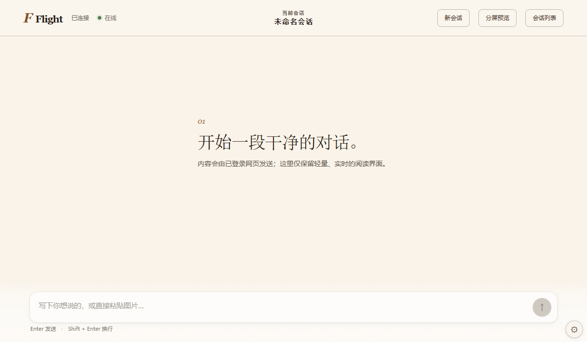

# ✈️ Flight Chat

一个基于 Tauri 的 ChatGPT 桌面客户端，提供探针模式实现无干扰对话体验。



## ✨ 核心功能

### 🎯 探针模式
- **无渲染对话**：拦截 ChatGPT 网页端的消息渲染，仅在本地显示对话内容
- **性能优化**：避免网页 DOM 堆积导致的卡顿和崩溃
- **流式传输**：实时捕获 AI 回复的流式输出，无缝显示在本地界面

### 🪟 窗口管理
- **分屏模式**：可选择固定宽度或全屏平分的分屏布局
- **窗口尺寸**：支持多种预设窗口大小（标准/紧凑/宽屏/全高清）
- **快速切换**：轻松在浏览模式和飞行模式间切换

### ⚙️ 灵活配置
- **历史记录限制**：可配置加载的历史消息数量（1-50 条）
- **持久化设置**：所有配置本地保存，下次启动自动恢复
- **一键重启**：修改窗口尺寸后可快速应用新设置

## 🚀 快速开始

### 安装

下载最新版本的安装包：
- **Windows MSI**：`Flight Chat_0.1.1_x64_en-US.msi`
- **Windows NSIS**：`Flight Chat_0.1.1_x64-setup.exe`（推荐）

### 使用流程

1. **启动应用**：打开 Flight Chat
2. **打开登录页**：点击"打开登录页"按钮
3. **登录 ChatGPT**：在弹出的网页窗口中登录你的 ChatGPT 账号
4. **配置设置**（可选）：
   - 选择分屏宽度
   - 设置窗口大小
   - 调整历史记录限制
5. **进入飞行模式**：点击"进入飞行模式"开始使用
6. **开始对话**：在输入框中输入消息，享受流畅的对话体验

## 🛠️ 技术栈

- **框架**：Tauri v2
- **前端**：React + TypeScript
- **后端**：Rust
- **样式**：CSS（OKLCH 色彩空间）
- **构建工具**：Vite

## 📦 开发

### 环境要求
- Node.js 18+
- Rust 1.70+
- Tauri CLI

### 安装依赖
```bash
npm install
```

### 开发模式
```bash
npm run tauri dev
```

### 构建安装包
```bash
npm run tauri build
```

## 🔐 隐私说明

- **本地运行**：所有数据处理在本地进行
- **不保存对话**：不存储任何对话内容到服务器
- **网页桥接**：通过注入脚本与 ChatGPT 网页通信
- **用户数据**：应用数据存储在 `%APPDATA%` 目录

## ⚠️ 免责声明

本项目仅供学习交流使用，使用本工具产生的任何后果由用户自行承担。请遵守 OpenAI 的使用条款。

## 📝 许可证

MIT License

## 🤝 贡献

欢迎提交 Issue 和 Pull Request！

---

**注意**：探针模式会修改 ChatGPT 网页的 DOM 结构，存在被检测的可能性。建议仅个人使用，避免频繁操作。
